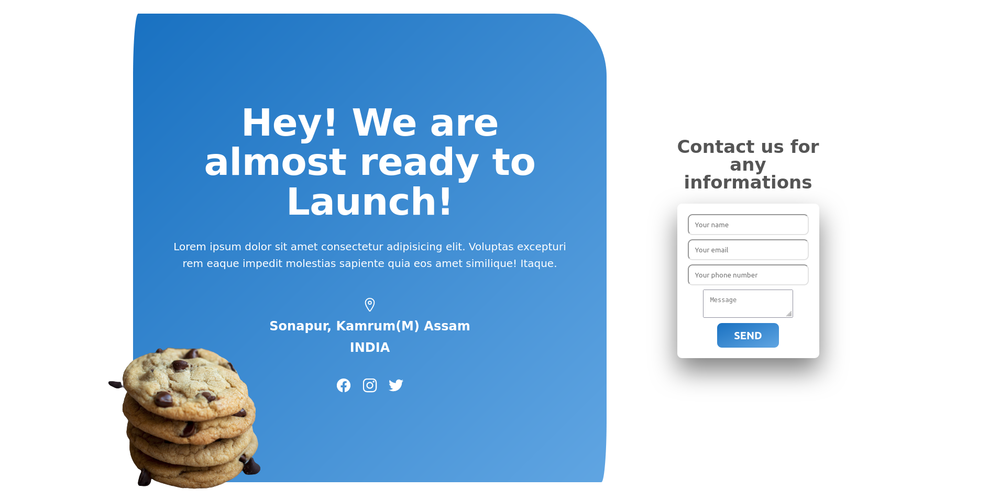

# Project - Commingsoon Page

This is a commingsoon landing page a challange by Tsquare-Digital.

## Table of contents

- [Overview](#overview)
  - [Screenshot](#screenshot)
  - [Links](#links)
- [My process](#my-process)
  - [Built with](#built-with)
  - [Time required](#time-required)
  - [What I learned](#continues-development)
  - [Useful resources](#useful-resources)
- [Author](#author)
- [Acknowledgments](#acknowledgments)

## Overview

### Screenshot



### Links

- Code File URL: [github.com](https://github.com/Jyotimoykathar/Project-01)
- Live Site URL: [netlify.app](https://project-01-trend2025.netlify.app/)

## My Process

### Built with

- Semantic HTML5 markup
- CSS custom properties
- Flexbox Css

### Time required

It took me nearly the hold day to complete the small challenge.

### What I learned

This is the css design code snippet of the media queries section, through which i got more clear on screen sizes break points.

```css
@media (max-width: 59em) {
  html {
    font-size: 50%;
  }
  .grid--2-cols {
    grid-template-columns: 1fr;
  }
  .heading-secondary {
    margin-top: 4.6rem;
    padding-top: 2.4rem;
  }
  .left-heading-image .cookie-image {
    position: absolute;
    left: -8rem;
    bottom: -4.7rem;
  }
  .left-heading-image .cookie-image img {
    width: 90%;
  }
}
```

### Continued development

I have still a lot to grab on positioning elements. The breakpoints of media queries still need to be smooth.

### Useful resources

- [MDN](https://developer.mozilla.org/en-US/) - This website helped me to any thing i had to look upon.

## Author

- Github page- [Jyotimoykathar](https://github.com/Jyotimoykathar/)

## Acknowledgments

Special Thanks to [MDN](https://developer.mozilla.org/en-US/) website and to [Tsquare](https://about.me/tsquaredigital) team for this small challenge.
